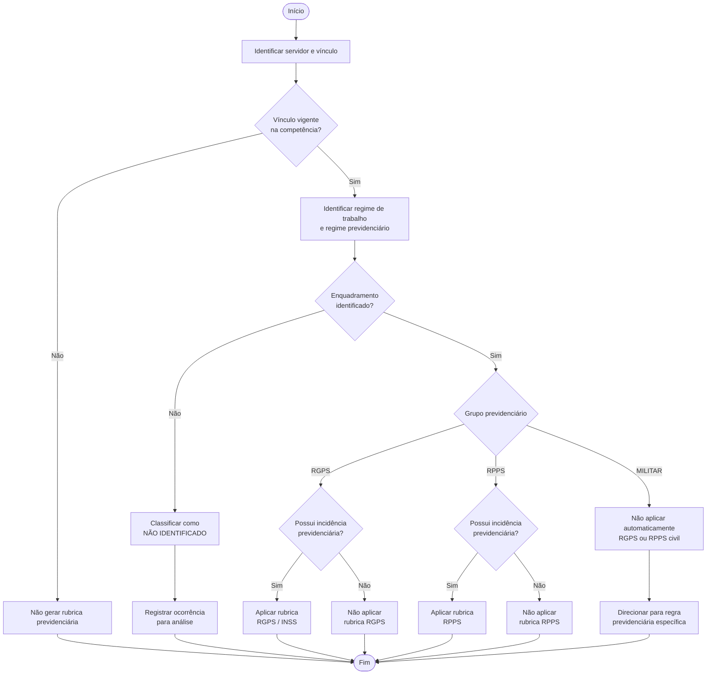
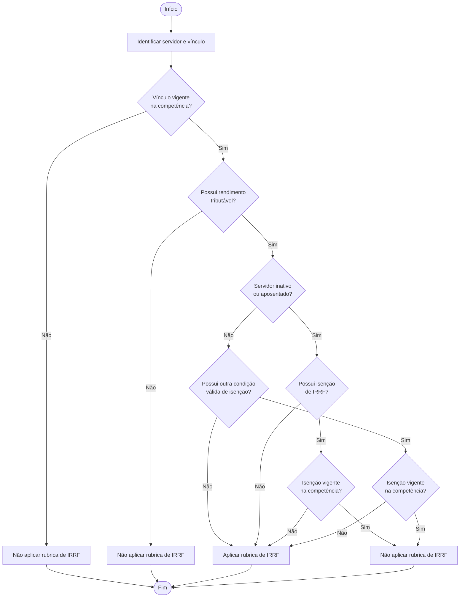

# Diagramas da solução

Este diretório contém os diagramas utilizados para representar os principais fluxos de decisão da solução de parametrização.

Os arquivos `.mmd` correspondem aos arquivos-fonte dos diagramas e permitem sua manutenção e versionamento.

## 1. Fluxo de enquadramento previdenciário

O fluxo abaixo representa a identificação do enquadramento previdenciário e a decisão sobre a aplicabilidade das rubricas de RGPS ou RPPS.



### Interpretação

O processamento segue quatro etapas principais:

1. validação da vigência do vínculo;
2. identificação do enquadramento previdenciário;
3. avaliação da incidência previdenciária;
4. determinação da rubrica aplicável.

Registros cujo enquadramento não possa ser determinado não produzem automaticamente uma rubrica previdenciária e devem ser encaminhados para análise.

O regime militar também permanece separado das regras gerais de RGPS e RPPS civil, permitindo tratamento específico.

---

## 2. Fluxo de decisão do IRRF

O fluxo de IRRF é independente do enquadramento previdenciário. Seu objetivo é determinar se a rubrica de Imposto de Renda deverá participar do processamento na competência analisada.



### Interpretação

A decisão de IRRF considera inicialmente a validade do vínculo e a existência de rendimento tributável.

A condição de servidor inativo ou aposentado não representa, isoladamente, uma isenção. Para impedir o lançamento da rubrica deverá existir uma condição de isenção aplicável e vigente na competência processada.

Dessa forma, a decisão pode resultar em:

- **aplicar IRRF**, quando existirem as condições de tributação e nenhuma isenção válida;
- **não aplicar IRRF**, quando não houver rendimento tributável ou existir isenção vigente;
- **não processar a regra**, quando o vínculo não estiver vigente.

---

## 3. Independência entre as decisões

Os dois fluxos devem ser avaliados de forma independente.

O enquadramento previdenciário determina a aplicabilidade das rubricas de contribuição previdenciária, enquanto o fluxo tributário determina a aplicabilidade da rubrica de IRRF.

Consequentemente, um mesmo servidor poderá produzir, por exemplo:

```text
RGPS + IRRF
RPPS + IRRF
RGPS
RPPS
Nenhuma rubrica
```

Essa separação reduz o acoplamento entre as regras e facilita a manutenção da parametrização.
